# Spring dmdev

# 1 Введение

### 1.1 Введение
- Библиотека - набор доп методов
- Фреймворк - каркас приложения
- Spring удобный

### 1.3 `Dependency Injection. Inverison of control`
- **`Dependencies`** (зависимости) – другие объекты, с которыми работает текущий объект и использует их функциональность
- **`IoC` (Inversion of Control) - инверсия управления** - принцип программирования, при котором управление программой передается фреймворку, а не программисту
- **`DI` (dependency injection)** – внедрение зависимостей – одна из реализаций IoC, посредством которой созданием объекта и внедрением его зависимостей занимается другой объект (фреймворк)
- **`DI`** внедряет зависимости через: конструктор, статический метод, свойства

### 1.4 `IoC Container`
- Это объект, который занимается созданием других объектов и внедрением в них зависимостей
- `Bean` – объект со всеми необходимыми зависимостями, который **был создан** `IoC Container` (`Controller, Service, Repository`)
- Кроме `Bean`, в `Spring` приложении есть `POJO - dto, entity`. Не содержат логики
- `IoC Container` реализует `BeanFactory, ApplicationContext`
- Есть разные `IoC` контейнеры. Для xml-конфигурации один, (`ClassPathXmlApplicationContext`), для других - другие
- Бины в контексте хранятся как `Map<String, Object>`, то есть id String(!). генерится по разному, как например скажем


# 2 XML-based Configuration
### 2.1 XML-based Configuration
- Методы `BeanFactory`


- Используется в основном реализация `ApplicationContext`
- Для xml - `ClassPathApplicationContext`, передаем в него адрес файла с бинами xml
- получить бин: `context.getBean(class)`, `context.getBean(String id/alias)` (вернет `object`), `context.getBean(id, class)` - конкретный бин класса
- если не указать `id`, в мапе бинов `ioc` `id` будет `имя класса#номер`
- если не указать `id/name` и сделать `getBean(class)`, то будет `exception`
- вызывается конструктор без параметров (рефлексия)


### 2.2 Constructor injection
- Можно указать name - имя аргумента, тип - для перегруженных конструкторов


### 2.3 Factory Method Injection
- Чтобы ссылаться на бин при создании бинов, нужно указывать не value а ref
- вместо конструкторов при создании бина можно использовать Фабричный метод:


### 2.4 Property Injection
- Можно внедрять с помощью сеттеров, **но есть минусы: поле должно быть не final и возоможны циклические зависимости**
- Вот как в xml:


- Жизненный цикл бина:


- Мы даем `definitions` - метаинфу
- `контейер`:
  - сортирует (сначала нужно создать те, у которых нет зависимостей, и потом уже их внедрять в последующие)
  - вызывает конструктор
  - сеттеры
  - создает

### 2.5 Bean Scopes


- основные (не считая `web`): `singleton` и `prototype`
- для `prototype` `IoC` при каждом запросе прогоняет полностью жизненный цикл бина и **выплевывает** его, не запоминая

### 2.6 Lifecycle Callbacks
- Можно добавлять `PostContruct/PreDestroy` методы, **лучше использовать аннотации**


> PreDestroy методы вызываются при закрытии контекста
> 
> ! У Контекста (= `IoC-контейнера`) на прототипы нет ссылки! он ее выплюнул, у прототипов PreDestroy не вызываются

### 2.7 properties файлы
- источник данных для приложения. благодаря им не нужно каждый раз перекомпилить


- можно использовать в xml ))

### 2.8 BeanFactoryPostProcessor
- Всякие el-выражения для properties и т п рассчитывает BeanFactoryPostProcessor


### 2.9 Custom BeanFactoryPostProcessor
- Можно реализовать свои BeanFactoryPostProcessor. Для этого реализовать в них BeanFactoryPostProcessor
- Можно настраивать порядос помощью implements Ordered getOrder или implements PriorityOrdered

# 3 Annotation-based configuration

### 3.1 Annotation-based Configuration
- В xml можно добавить


- Он добавит необходимые бины для аннотаций и др., а именно:


> `BeanFactoryPostProcessor` уже знаем, а вот `BeanPostProcessor` - новый этап `Lifecycle`

### 3.2 BeanPostProcessor

- `BeanPostProcessor` - это особенные бины, которые участвуют в жизненном цикле бинов и занимаются их конфигураций (наподобие `BeanFacotryPostProcessor`, только для Beans, а не `Bean Definitions`).
- ! `BeanFactoryPostProcessor` вызывается для контекста 1 раз, а `BeanPostProcessor` - для каждого бина


- `Aware` интерфейсы - помогают инжектить в бин-пост процессоры, например, контекст. Имеют сеттеры, нужно их реализовать
- Порядок инициализации в `контексте` (= `IoC` контейнере):
1. `AwareBeanPostProcessors` – чтобы инжектить зависимости в сами пост процессоры
2. `BeanPostProcessors` – чтобы обрабатывать бины
3. `Beans`

### 3.3 Свой BeanPostProcessor

> 1 Сделали свою аннотацию `InjectBean`
> 
> 2 В `PostProcessor` берем все филды, и для этой аннотации ищем в контексте бин этого типа, инжектим, конец
> 
> 3 ! Внедряем в пост процессор `application context` с помощью `ApplicationContextAware` и `set` метода

```java
@Retention(RetentionPolicy.RUNTIME)
@Target(ElementType.FIELD)
public @interface InjectBean {
}

```
```java
public class Repository {

    @InjectBean
    private ConnectionPool connectionPool;

    @PostConstruct
    public void init() {
        System.out.println("ConnectionPool: " + connectionPool);
    }

}
```
```java
public class InjectBeanPostProcessor implements BeanPostProcessor, ApplicationContextAware {

    private ApplicationContext applicationContext;

    @Override
    public Object postProcessBeforeInitialization(Object bean, String beanName) throws BeansException {
        Arrays.stream(bean.getClass().getDeclaredFields())
                .filter(field -> field.isAnnotationPresent(InjectBean.class))
                .forEach(field -> {
                    field.setAccessible(true);
                    ReflectionUtils.setField(field, bean, applicationContext.getBean(field.getType()));
                });
        return bean;
    }

    @Override
    public void setApplicationContext(ApplicationContext applicationContext) throws BeansException {
        this.applicationContext = applicationContext;
    }
}
```

### 3.4 Свой BeanPostProcessor 2

- Есть методы:

```java
     Object postProcessBeforeInitialization(Object bean, String beanName) throws BeansException; // до колбека PostConstruct
// и
     Object postProcessAfterInitialization(Object bean, String beanName) throws BeansException; // после колбека PostConstruct
```

> и если мы привносим какую-то сквозную функциональность с помощью Proxy, то нужно это делать в `postProcessAfterInitialization`, так как прокси вернет другой класс и могут быть ошибки

### 3.5 @Autowired, @Resource, @Value
> `@Resource` то же самое что `@Autowired`, просто чтобы поддерживать спецификацию `JavaEE`, лучше использовать `@Autowired`
> 
> `@Autowired` можно в поле, сеттере, конструкторе
> 
> Если несколько бинов - использовать `@Qualifier(beanId)` **или** **просто назвать поле/аргумент сеттера как** `id` бина
> 
> `@Value(${spring.el})` - подставить из пропертей

### 3.6 Classpath scanning
- В пакете stereotype есть аннотации `Component, Controller, Service, Repository`
- Последние 3 – просто наследуют `Component`, для логического разделения
- В `value Component` можно написать id бина `@Component("myBean1")`
- Если сделать как поле или аргумент конструктора `List<MyBean>`, то `Spring` вставит в него все бины

> Почему `Autowired` через конструктор - лучше
> 1. **Безопасность NPE:** Зависимости через конструктор гарантированно инициализированы при создании бина, их можно сделать `final`. `@Autowired` выкинет ошибку, если не найдет бина и required!=false, но в какой-то момент может быть `null`
> 2. **Порядок инициализации:** через конструктор зависимости доступны сразу после создания бина. `@Autowired` срабатывает после конструктора, что может вызвать проблемы
> 3. **Тестирование:** С конструктором можно легко создать объект в тестах без Spring-контекста. `@Autowired` требует настройки контекста или `ReflectionTestUtils`
> 4. **Явные зависимости:** Конструктор явно показывает все обязательные зависимости класса, и если их слишком много, и позволяет обнаружить циклические
> 5. **Spring recommendation:** Официальная документация `Spring` рекомендует `constructor injection`

### 3.7 Bean Definition Readers
- Они читают xml/аннотации и строят контекст


### 3.8 TypeFilters


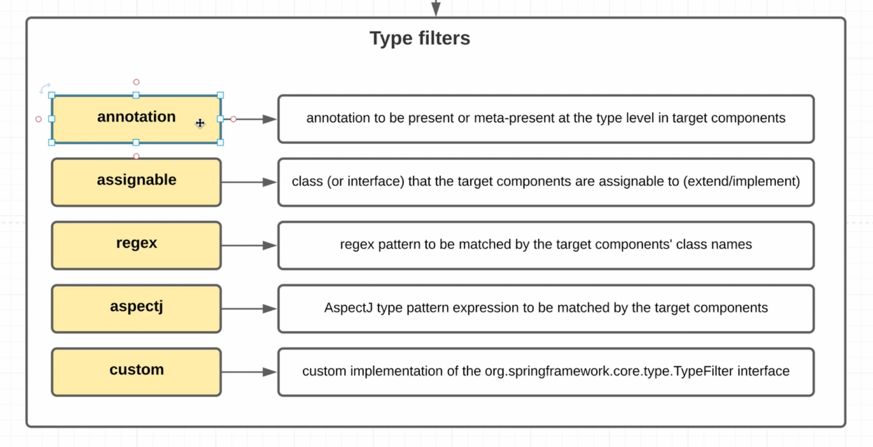

Так Spring понимает, какие классы - бины. По умолчанию - `annotation`. То есть `@Component`, и т п. 
Можно настраивать в аннотации `@ComponentScan`: например `regex` - все, оканчивающиеся на Bean и т п.

### 3.9 @Scope

В аннотациях scope можно указывать в аннотации `@Scope: "prototype", "singleton"`

### 3.10 JSR 250, JSR 330

Для совместимости Spring поддерживает аннотации JSR:

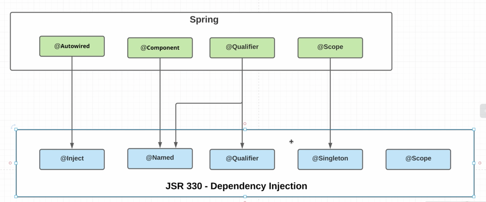

# 4. Java-based Configuration

### 4.1 Java-based Configuration

Пример кастомных фильтров в аннотации:


Создать `ApplicationConfiguration` контекст:
```java
ApplicationContext ctx = new AnnotationConfigApplicationContext(ApplicationConfiguration.class);
```

Что под капотом:
у `AnnotationConfigApplicationContext` есть поля `reader`, `scanner`, и в конструкторе для всех бинов 
вызывается метод `register()`

> Отличия `@Configuration` и `@ComponentScan`:
> - `@Configuration`: в текущем классе читать бины с аннотацией `@Bean`. В не-помеченных классах 
> Spring тоже сканирует, но `@Configuration` - в первую очередь, поэтому обычно пишут `@Bean` именно там
> - `@ComponentScan`: сканировать пакет на `@Component` – по умолчанию пакет класса с аннотацией 
> @ComponentScan и его подпакеты

### 4.2 @Import & @ImportResource
В классе `@Configuration` можно указывать xml файлы с помощью `@ImportResource` (не используется) 
и другие классы-Configuration с помощью `@Import`, чтобы комбинировать конфигурации

### 4.3 @Bean. Часть 1
- Название метода - id бина
- Чтобы указать конкретный id бина при внеднерии, либо назвать аргумент/поле как id, либо 
- `@Qualifier("id")`
- Аргументы `@Bean`:
  - `autowireCandidate`: использовать ли при внедрении
  - `initMethod`, `destroyMethod` - аналоги `PostConstruct` и `PreDestroy`
- Можно при `@Bean` указывать `@Scope`

### 4.4 @Bean. Часть 2
- Можно внедрять бины прямо как вызов метода, как в `userRepository3`:

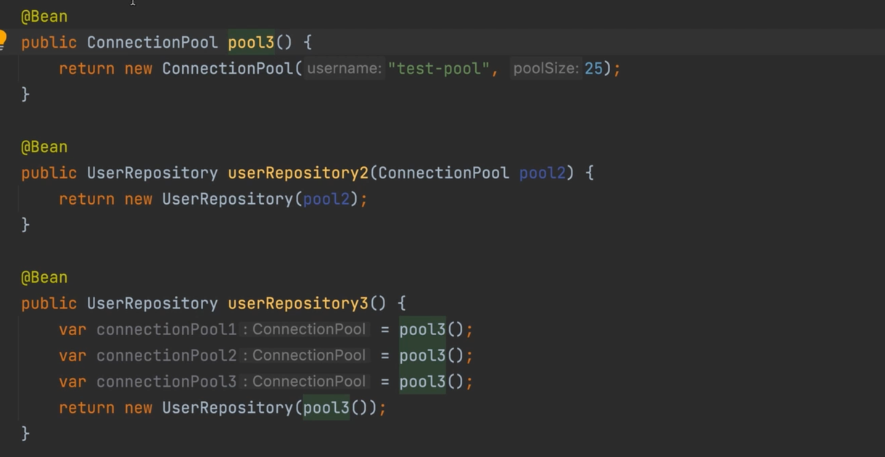

> У pool3 не указан **`scope`**, т. е. он синглтон, и **`pool3()`** будет возвращать
> **один и тот же бин!** 

### 4.5 Profiles

Аннотацию `@Profile` можно ставить над `@Bean` или над `@Component`. В ней указывать профили.
- Поддерживает логические выражения:


# 5. EventListeners

### 5.1 EventListeners. 1,2

В Spring можно делать слушатели событий:
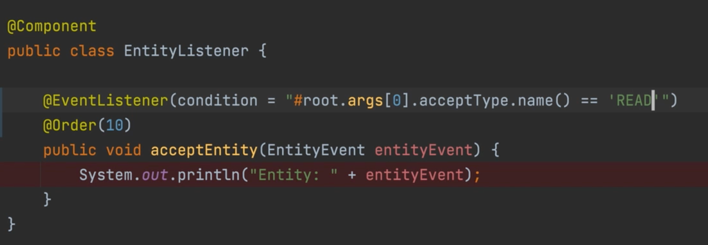


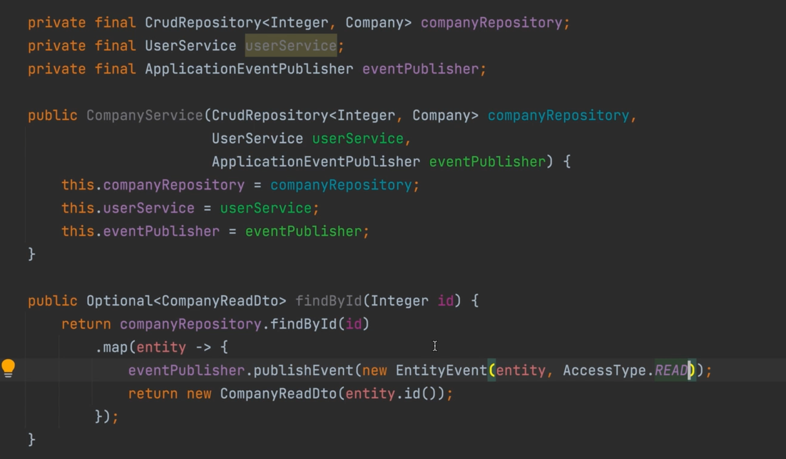

# 6. Spring Boot

### 6.1 Spring Boot. Введение

Если добавлять какие-то зависимости/модули в `Spring`, их нужно конфигурировать. 
`Spring Boot` все конфигурации содержит из коробки: в каждое `Spring Boot` приложение транзитивно тянется
```xml
org.springframework.book:spring-boot-autoconfigure
```

Спринг бут делает за нас это:

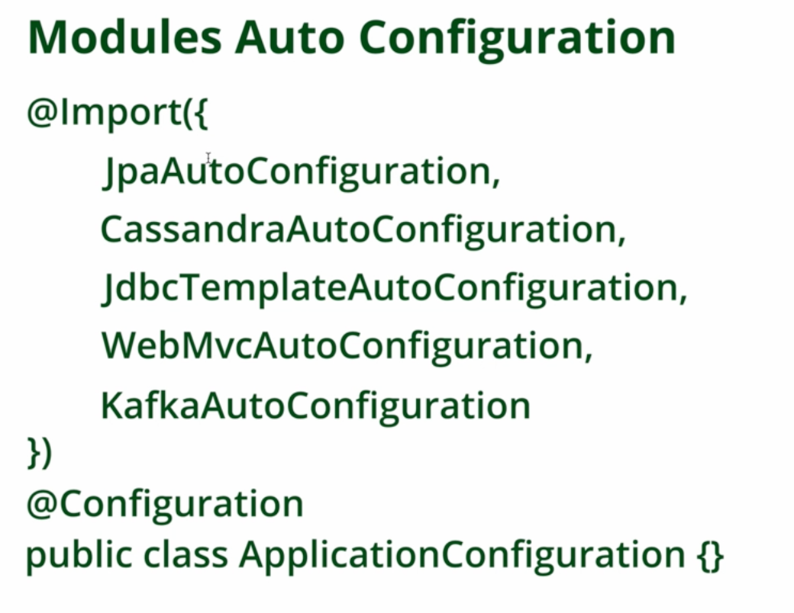

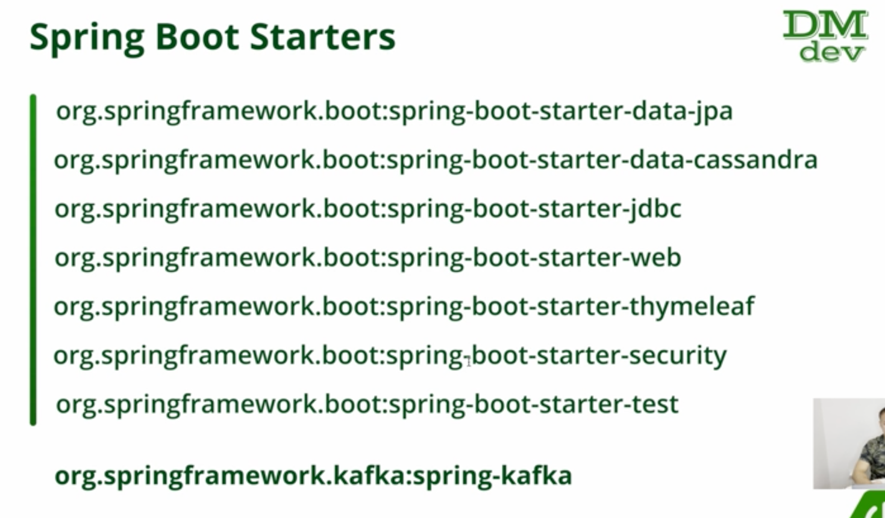

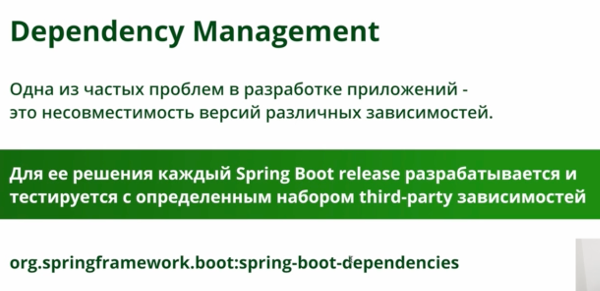

Бины, автоматически настроенные `Spring Boot`, можно переопределить

### 6.2 @Conditional

- Можно создавать бины/конфигурации по условиям: аннотация `@Conditional` (`@Profile` использует ее под капотом)
- Передаем в нее Class, который реализует интерфейс Condition и его метод `matches(ConditionContext, AnnotatedTypeMetadata)`

В `Spring Boot` есть свои аннотации:


### 6.3 Spring Boot. Настройка проекта

- `Gradle`:
  - добавить plugin `spring boot`
  - добавить plugin `dependency management`
  - добавить dependency `spring-boot-starter`
  - версии не указываем, `spring boot` `dependency management` делает это за нас
- `Main class`:
  - `SpringBootApplication.run(class, args)`
  - `@SpringBootApplication`
- Можно сделать с `Spring initialzr`
- `Maven`:
  - У него есть `<parent> spring-boot-starter-parent`
  - В `parent` есть `spring-boot-dependencies`, и в нем **куча** версий зависимостей на все случаи жизни, совместимых с этой версией `spring boot`

С Spring Boot включены следующие зависимости:

### 6.4 `@SpringBootApplication`

- Все классы и пакеты должны лежать на том же уровне/ниже класса `@SpringBootApplication`
- `SpringBootApplication.run` возвращает контекст
- `@SpringBootApplication` содержит:
  - `@SpringBootConfiguration` (Configuration, но одна на класс)
  - `@ComponentScan`
  - `@PropertySource` подтягивается тоже, сканируется application properties/yaml
  - `@EnableAutoConfiguration` – автоматически подтягиваются автоконфигурации 
из `spring-boot-autoconfigure`, но подтягиваются по условиям `@Conditional`,
могут добавлять какие-то свои бины (**то есть Spring Boot может добавлять какие-то бины**)

### 6.5 Lombok
- Вместо всех gradle зависимостей по типу preprocessor, можно подключить gradle plugin:


Аннотации:
- `@Cleanup`: аналог try-with-resources но более гибкая
- `@NonNull`: на аргументе метода будет проверять и кидать `NPE` если передан `null` с именем аргумента
- `@SneakyThrows`: может быть полезна в лямбдах
- `@RequiredArgsConstructor`: конструктор для `@NonNull` и `final` полей

> Как с помощью `lombok` сделать конструктор для `final`-полей `@Value`?
> 1. Делам lombok.config:
> 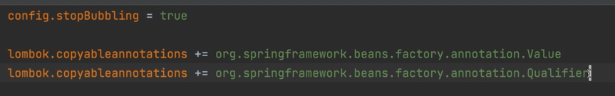
> 2. Ставим над final полем аннотацию `@Value`/Qualifier и т п
> 3. Пишем @RequiredArgsConstructor и т п
> 4. Все, lombok сам в конструктор поставит аннотации

### 6.6 Properties

Можно сделать файл spring.properties, он для более low-level
пропертей, его проперти можно получить через SpringProperties.method

Вообще, есть 14 вариантов задания пропертей:


> Каждый из последущих имеет более высокий приоритет, чем предыдущий

> `VM options` задаются через `-D`, `Program arguments` через `--`
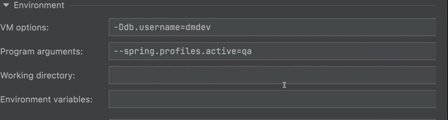


### 6.7 yaml
В целом он удобнее, в том числе работа со списками, объектами:


### 6.8 `@ConfigurationProperties`

> Можно маппить проперти в объекты/record:

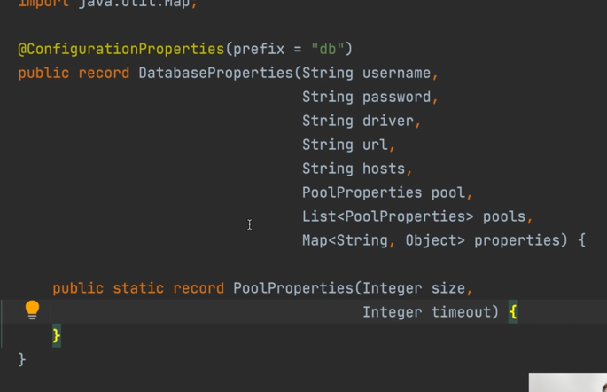


# 7. Logging Starter

### 7.1 Logging Starter

Для логов есть разные реализации, по умолчанию идет джавовская
`logback`, можно переопределить:

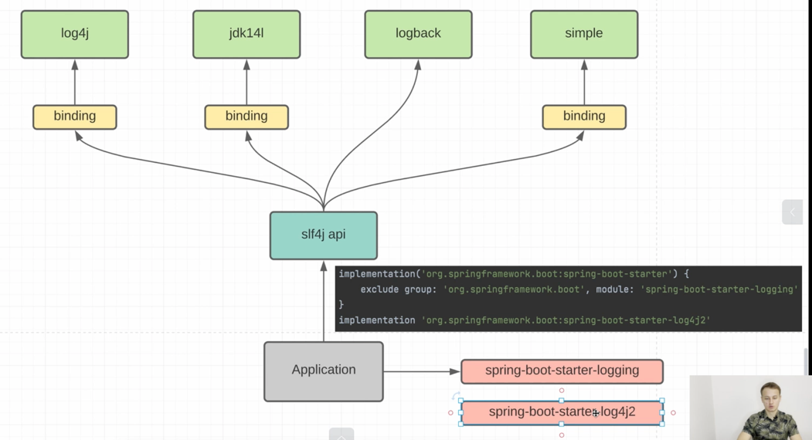


Используя аннотацию `@Slf4j`, вот что под капотом:


т.е. то же самое

Логи можно настраивать в properties, причем для разных классов разное:


### 7.2 Logback Configuration

Во всех логгерах 2 основных понятия: `appender` (куда выгружаем логи: файл, консоль, другой сервер итп)
и `logger` (пишет в аппендеры, напр `root`)

Можно более низкоуровнево настраивать логи: переопределить `xml` файл конфигурации.
В зависимости от используемой системы, например `logback`:


# 8. Test Starter

### 8.1 Test Starter

Что входит в `starter-test`:

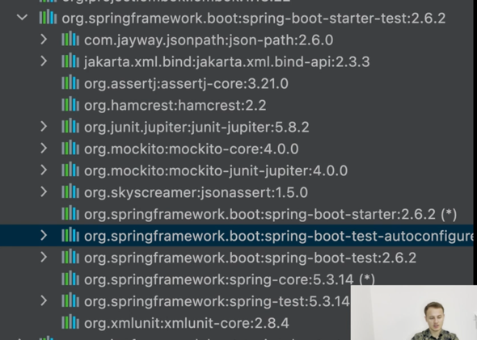

Базовый тест:


### 8.2 Spring Integration testing. P1

Для интеграционных тестов нужно как-то:
1. Внедрить зависимости
2. Кэшировать контекст, чтобы не поднимать каждый раз
3. Управлять транзакциями

Из чего состоит `Spring Integration testing`:


Есть колбеки:


`Test context framework`:


### 8.3 Spring Integration testing. P2

> Под тесты лучше код не менять

```java
@ExtendWith(SpringExtention.class) // интеграция JUnit5 с Spring TestContext
@ContextConfiguration(SpringApplication.class) // класс где запускается SpringBoot приложение
```

Эти две аннотации можно заменить на `@SpringBootTest`:

(`SpringBoot...Bootstraper` автоматически ищет класс `SpringBootApplication`)

Пример интеграционного теста:
```java
@SpringBootTest
//@ExtendWith(SpringExtension.class)
//@ContextConfiguration(classes = ApplicationRunner.class, initializers = ConfigDataApplicationO
  public class CompanyServiceIT {
    private static final Integer COMPANY_ID = 1;
    @Autowired // в тестах так можно
    private CompanyService companyService;
    @Test
    void findById() {
        var actualResult =  Optional<CompanyReadDto> = companyService.findById(COMPANY_ID);
        assertTrue(actualResult.isPresent());|
        var expectedResult = new CompanyReadDto (COMPANY_ID);
        actualResult.ifPresent(actual -> assertEquals(expectedResult, actual));
    }
}
```

> На каждый класс `@SpringBootTest` создается `TestContextManager` (см. 8.2), 
> `TestContext` содержит информацию о выполняемом тесте, а `TestExecutionListeners` 
> выполняют различную логику, например внедрение зависимостей

### 8.4 Spring Integration testing. P3

> Чтобы не дублировать везде `@ActiveProfiles` и `@SprintBootTest` можно сделать
свою аннотацию:
> 
> 

> Чтобы не писать над полями `@Autowired`, можно аналогично сделать их 
> `final` и добавить `@RequiredArgsConstructor`, но нужно будет добавить:
> - или 
> 
> - или в `test/resources/spring.properties`: 
> 

### 8.5 Context Caching

Если Spring видит изменение конфигурации контекста в разных, например, классах,
то он пересоздает контекст. Например, если на одном классе есть `@ActiveProfiles("test")`,
пересоздаст.

Если пометим какой-то бин как `@SpyBean` или `@MockBean`, то пересоздаст

Если хотим что-то переопределить для всего контекста, то делаем класс 
`@TestConfiguration` и 


Помечать контекст "испорченным" можно с помощью аннотации `@DirtiesContext`
над классом или методом

# 9. Data JPA Starter

### 9.1 Data JPA Starter. Введение

У чистого `Hibernate` есть проблемы:
- нужно писать самому логику `dao`
- нет декларативного способа управления транзакциями
- сложная конфигурация

Как решает проблемы `Spring Data Jpa`:


### 9.2 Data JPA Starter. Подключение

Что входит:


> `Hikari` - самый производительный `ConnectionPool`

При подключении стартера, подключается `HibernateJpaAutoConfiguration`:


Для `jpa` у `Spring` 2 основные "ветки" в `properties`:
- `spring.datasource`
- `spring.jpa`

### 9.3 Hibernate Entities

Спринг бут автоматом сканит `Entity` классы в субдиректориях `@SpringBootApplication`,
но если например лежит в другом пакете, можно указать аннотацию
`@EntityScan("путь")` 

