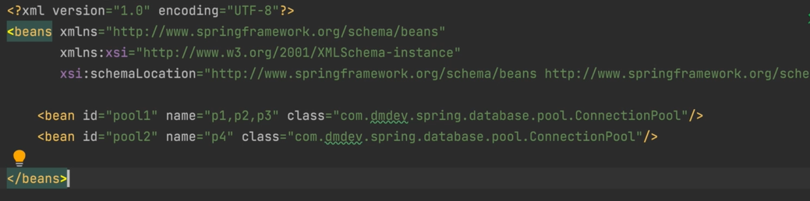
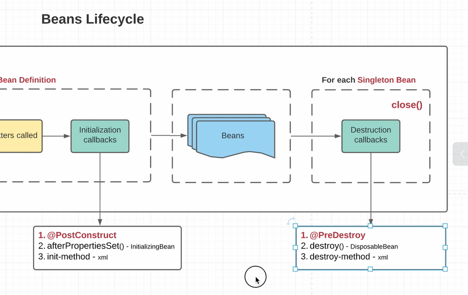
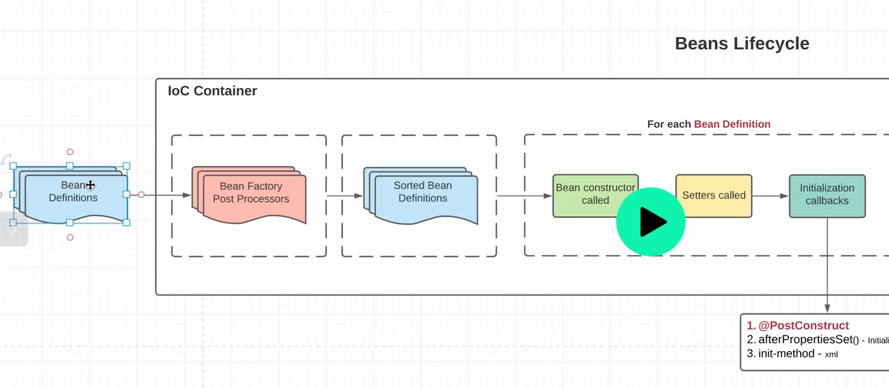
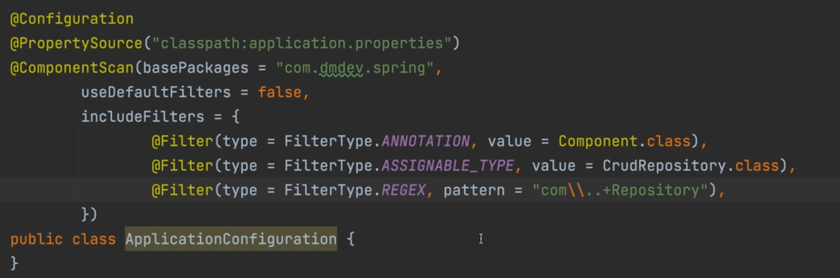
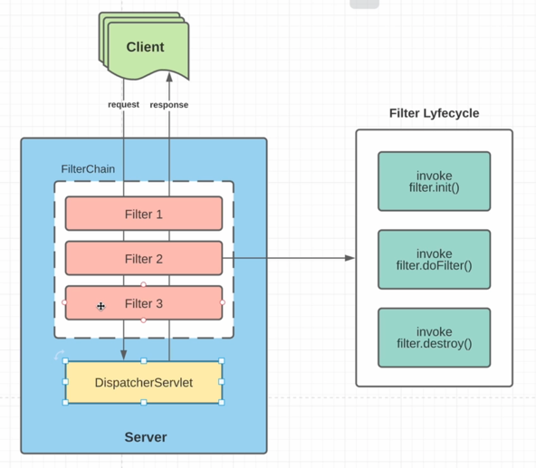
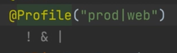
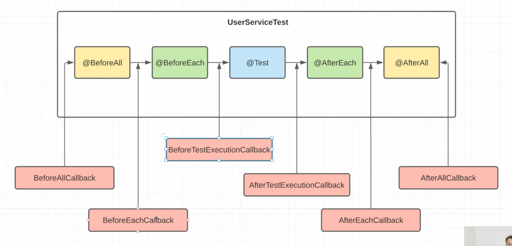
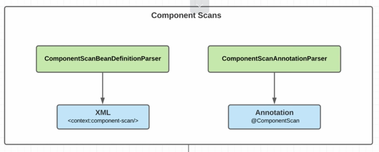
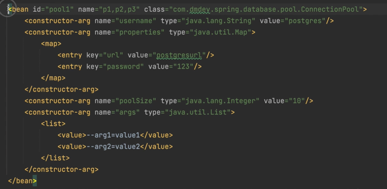
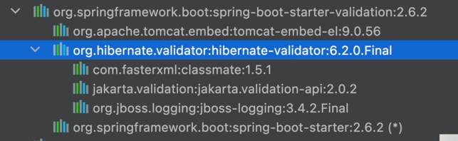

# Spring dmdev

# 1 Введение

## 1.1 Введение
- Библиотека - набор доп методов
- Фреймворк - каркас приложения
- Spring удобный

## 1.3 `Dependency Injection. Inverison of control`
- **`Dependencies`** (зависимости) – другие объекты, с которыми работает текущий объект и использует их функциональность
- **`IoC` (Inversion of Control) - инверсия управления** - принцип программирования, при котором управление программой передается фреймворку, а не программисту
- **`DI` (dependency injection)** – внедрение зависимостей – одна из реализаций IoC, посредством которой созданием объекта и внедрением его зависимостей занимается другой объект (фреймворк)
- **`DI`** внедряет зависимости через: конструктор, статический метод, свойства

## 1.4 `IoC Container`
- Это объект, который занимается созданием других объектов и внедрением в них зависимостей
- `Bean` – объект со всеми необходимыми зависимостями, который **был создан** `IoC Container` (`Controller, Service, Repository`)
- Кроме `Bean`, в `Spring` приложении есть `POJO - dto, entity`. Не содержат логики
- `IoC Container` реализует `BeanFactory, ApplicationContext`
- Есть разные `IoC` контейнеры. Для xml-конфигурации один, (`ClassPathXmlApplicationContext`), для других - другие
- Бины в контексте хранятся как `Map<String, Object>`, то есть id String(!). генерится по разному, как например скажем


# 2 XML-based Configuration
## 2.1 XML-based Configuration
- Методы `BeanFactory`


- Используется в основном реализация `ApplicationContext`
- Для xml - `ClassPathApplicationContext`, передаем в него адрес файла с бинами xml
- получить бин: `context.getBean(class)`, `context.getBean(String id/alias)` (вернет `object`), `context.getBean(id, class)` - конкретный бин класса
- если не указать `id`, в мапе бинов `ioc` `id` будет `имя класса#номер`
- если не указать `id/name` и сделать `getBean(class)`, то будет `exception`
- вызывается конструктор без параметров (рефлексия)


## 2.2 Constructor injection
- Можно указать name - имя аргумента, тип - для перегруженных конструкторов


## 2.3 Factory Method Injection
- Чтобы ссылаться на бин при создании бинов, нужно указывать не value а ref
- вместо конструкторов при создании бина можно использовать Фабричный метод:


## 2.4 Property Injection
- Можно внедрять с помощью сеттеров, **но есть минусы: поле должно быть не final и возоможны циклические зависимости**
- Вот как в xml:


- Жизненный цикл бина:


- Мы даем `definitions` - метаинфу
- `контейер`:
  - сортирует (сначала нужно создать те, у которых нет зависимостей, и потом уже их внедрять в последующие)
  - вызывает конструктор
  - сеттеры
  - создает

## 2.5 Bean Scopes


- основные (не считая `web`): `singleton` и `prototype`
- для `prototype` `IoC` при каждом запросе прогоняет полностью жизненный цикл бина и **выплевывает** его, не запоминая

## 2.6 Lifecycle Callbacks
- Можно добавлять `PostContruct/PreDestroy` методы, **лучше использовать аннотации**


> PreDestroy методы вызываются при закрытии контекста
> 
> ! У Контекста (= `IoC-контейнера`) на прототипы нет ссылки! он ее выплюнул, у прототипов PreDestroy не вызываются

## 2.7 properties файлы
- источник данных для приложения. благодаря им не нужно каждый раз перекомпилить


- можно использовать в xml ))

## 2.8 BeanFactoryPostProcessor
- Всякие el-выражения для properties и т п рассчитывает BeanFactoryPostProcessor



## 2.9 Custom BeanFactoryPostProcessor
- Можно реализовать свои BeanFactoryPostProcessor. Для этого реализовать в них BeanFactoryPostProcessor
- Можно настраивать порядос помощью implements Ordered getOrder или implements PriorityOrdered

# 3 Annotation-based configuration

## 3.1 Annotation-based Configuration
- В xml можно добавить



- Он добавит необходимые бины для аннотаций и др., а именно:



> `BeanFactoryPostProcessor` уже знаем, а вот `BeanPostProcessor` - новый этап `Lifecycle`

## 3.2 BeanPostProcessor

- `BeanPostProcessor` - это особенные бины, которые участвуют в жизненном цикле бинов и занимаются их конфигураций (наподобие `BeanFacotryPostProcessor`, только для Beans, а не `Bean Definitions`).
- ! `BeanFactoryPostProcessor` вызывается для контекста 1 раз, а `BeanPostProcessor` - для каждого бина



- `Aware` интерфейсы - помогают инжектить в бин-пост процессоры, например, контекст. Имеют сеттеры, нужно их реализовать
- Порядок инициализации в `контексте` (= `IoC` контейнере):
1. `AwareBeanPostProcessors` – чтобы инжектить зависимости в сами пост процессоры
2. `BeanPostProcessors` – чтобы обрабатывать бины
3. `Beans`

## 3.3 Свой BeanPostProcessor

> 1 Сделали свою аннотацию `InjectBean`
> 
> 2 В `PostProcessor` берем все филды, и для этой аннотации ищем в контексте бин этого типа, инжектим, конец
> 
> 3 ! Внедряем в пост процессор `application context` с помощью `ApplicationContextAware` и `set` метода

```java
@Retention(RetentionPolicy.RUNTIME)
@Target(ElementType.FIELD)
public @interface InjectBean {
}

```
```java
public class Repository {

    @InjectBean
    private ConnectionPool connectionPool;

    @PostConstruct
    public void init() {
        System.out.println("ConnectionPool: " + connectionPool);
    }

}
```
```java
public class InjectBeanPostProcessor implements BeanPostProcessor, ApplicationContextAware {

    private ApplicationContext applicationContext;

    @Override
    public Object postProcessBeforeInitialization(Object bean, String beanName) throws BeansException {
        Arrays.stream(bean.getClass().getDeclaredFields())
                .filter(field -> field.isAnnotationPresent(InjectBean.class))
                .forEach(field -> {
                    field.setAccessible(true);
                    ReflectionUtils.setField(field, bean, applicationContext.getBean(field.getType()));
                });
        return bean;
    }

    @Override
    public void setApplicationContext(ApplicationContext applicationContext) throws BeansException {
        this.applicationContext = applicationContext;
    }
}
```

## 3.4 Свой BeanPostProcessor 2

- Есть методы:

```java
     Object postProcessBeforeInitialization(Object bean, String beanName) throws BeansException; // до колбека PostConstruct
// и
     Object postProcessAfterInitialization(Object bean, String beanName) throws BeansException; // после колбека PostConstruct
```

> и если мы привносим какую-то сквозную функциональность с помощью Proxy, то нужно это делать в `postProcessAfterInitialization`, так как прокси вернет другой класс и могут быть ошибки

## 3.5 @Autowired, @Resource, @Value
> `@Resource` то же самое что `@Autowired`, просто чтобы поддерживать спецификацию `JavaEE`, лучше использовать `@Autowired`
> 
> `@Autowired` можно в поле, сеттере, конструкторе
> 
> Если несколько бинов - использовать `@Qualifier(beanId)` **или** **просто назвать поле/аргумент сеттера как** `id` бина
> 
> `@Value(${spring.el})` - подставить из пропертей

## 3.6 Classpath scanning
- В пакете stereotype есть аннотации `Component, Controller, Service, Repository`
- Последние 3 – просто наследуют `Component`, для логического разделения
- В `value Component` можно написать id бина `@Component("myBean1")`
- Если сделать как поле или аргумент конструктора `List<MyBean>`, то `Spring` вставит в него все бины

> Почему `Autowired` через конструктор - лучше
> 1. **Безопасность NPE:** Зависимости через конструктор гарантированно инициализированы при создании бина, их можно сделать `final`. `@Autowired` выкинет ошибку, если не найдет бина и required!=false, но в какой-то момент может быть `null`
> 2. **Порядок инициализации:** через конструктор зависимости доступны сразу после создания бина. `@Autowired` срабатывает после конструктора, что может вызвать проблемы
> 3. **Тестирование:** С конструктором можно легко создать объект в тестах без Spring-контекста. `@Autowired` требует настройки контекста или `ReflectionTestUtils`
> 4. **Явные зависимости:** Конструктор явно показывает все обязательные зависимости класса, и если их слишком много
> 5. **Spring recommendation:** Официальная документация `Spring` рекомендует `constructor injection`

## 3.7 Bean Definition Readers
- Они читают xml/аннотации и строят контекст




## 3.8 TypeFilters




Так Spring понимает, какие классы - бины. По умолчанию - `annotation`. То есть `@Component`, и т п. Можно настраивать в аннотации `@ComponentScan`: например `regex` - все, оканчивающиеся на Bean и т п.

## 3.9 @Scope

В аннотациях scope можно указывать в аннотации `@Scope: "prototype", "singleton"`

## 3.10 JSR 250, JSR 330

Для совместимости Spring поддерживает аннотации JSR:

